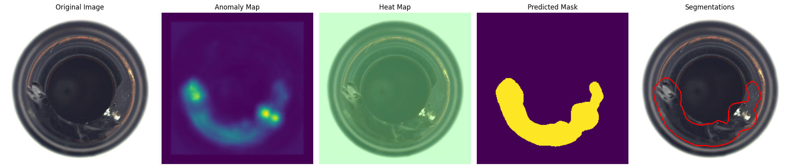

# EfficientAd-AnomalyDetection-Mvtec
Developing an anomaly detection model using the EfficientAD model on the MVTec AD dataset and exporting the model in OpenVINO format


# Anomaly Detection with EfficientAD on MVTec AD Dataset

This project demonstrates anomaly detection using the EfficientAD model on the MVTec Anomaly Detection (MVTec AD) dataset. The model is trained, evaluated, and exported to OpenVINO format for deployment on Intel hardware.

## Overview

Anomalies in images are detected using a deep learning model (EfficientAD) trained on the MVTec AD dataset. The MVTec AD dataset consists of various categories of industrial objects, and each category includes normal and anomalous samples. The EfficientAD model is implemented using the Anomalib library, which is a deep learning library designed for anomaly detection tasks.

In this project, the following tasks are performed:
1. **Data Preparation**: MVTec AD dataset is loaded and preprocessed.
2. **Model Training**: EfficientAD model is trained on the dataset using PyTorch.
3. **Model Evaluation**: The model's performance is evaluated using different metrics such as AUROC.
4. **Model Export**: The trained model is exported to OpenVINO format for efficient inference on Intel hardware.
5. **Inference**: Inference is performed using the OpenVINO model, and the results are visualized.

## Installation

1. **Clone the repository**:

```bash
   git clone <repository_url>
   cd <repository_directory>
```

2. **Install dependencies**:

- Install required Python packages using pip:

```bash
pip install -r requirements.txt
```

-  Alternatively, if you're using Jupyter or Colab, you can install dependencies directly in the notebook:

```bash
pip install lightning
pip install kornia
pip install openvino-dev
pip install anomalib timm
pip install open_clip_torch
pip install onnx
```

## Dataset

This project uses the MVTec Anomaly Detection (MVTec AD) dataset, which contains several categories of industrial objects. The dataset is used for training and testing anomaly detection models. You can download the dataset from the official MVTec website.

Make sure to download the dataset and place it in the appropriate directory as specified in the code (`dataset_root`).

## Training the Model

The EfficientAD model is used for anomaly detection. It is trained on the MVTec AD dataset using the following steps:

1. **Prepare Data**: The data is loaded and preprocessed using the MVTecAD data module.
2. **Define Callbacks**: Callbacks such as ModelCheckpoint and EarlyStopping are used during training to monitor the performance of the model.
3. **Train the Model**: The model is trained using the Engine from the Anomalib library, which handles the training loop.

### Hyperparameters:
- **Train Batch Size**: 1
- **Eval Batch Size**: 32
- **Epochs**: Adjustable based on the training process.


## Training Output

The training process produces several logs and checkpoints, including the model’s performance metrics such as `train_loss` and `pixel_AUROC`.

## Model Export to OpenVINO

Once the model is trained, it is exported to the OpenVINO format for optimized inference on Intel hardware. The model is saved in the `weights/openvino` directory and can be loaded and run using OpenVINO's inference engine.

To export the model, the following code is used:

```python
engine.export(model=model, export_type=ExportType.OPENVINO)
```

## Inference

The exported OpenVINO model is loaded, and inference is performed on an image from the test set.

Inference is done on the CPU by default, but you can specify other devices like the GPU or MPS for faster performance.

## Visualization

The following visualizations are generated as part of the inference process:

- **Original Image**: The input image.
- **Anomaly Map**: The raw anomaly map output by the model.
- **Heat Map**: A heatmap combining the anomaly map with the original image.
- **Predicted Mask**: The segmentation mask highlighting the detected anomalies.
- **Segmentations**: The final segmentation result, which is a combination of the predicted mask and the original image.

### Example Output

The model predicts an anomaly mask for an image, which is visualized alongside the original image and anomaly map.

**Example Visualization**:



## Performance Metrics

- **Pixel AUROC**: Area Under the Receiver Operating Characteristic Curve, used to evaluate the model’s performance in detecting anomalies.
- **Inference Time**: Time taken for inference on a single image.
- **Model Loading Time**: Time taken to load the OpenVINO model.

## License

This project is licensed under the MIT License - see the LICENSE file for details.


EfficientAd-AnomalyDetection-Mvtec
